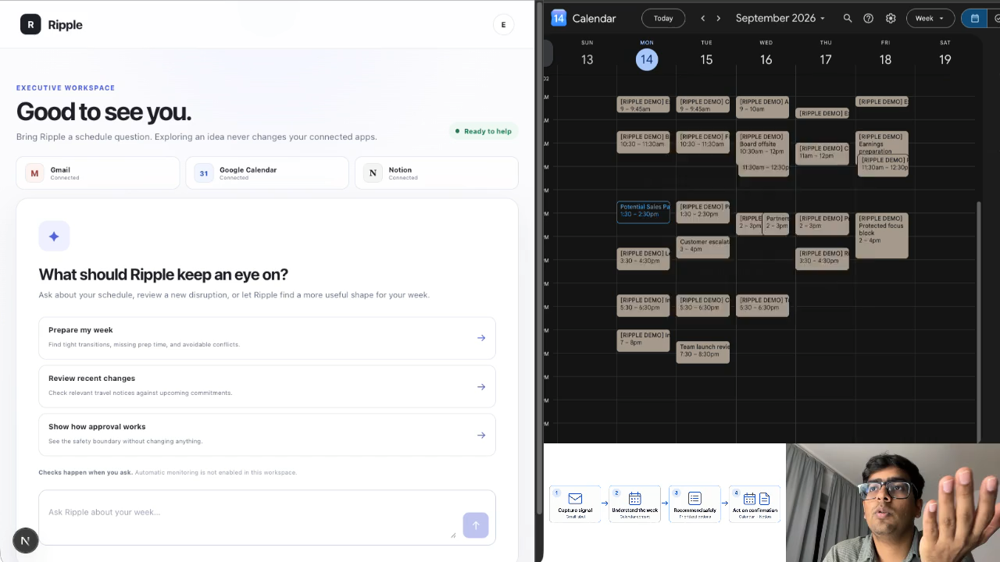
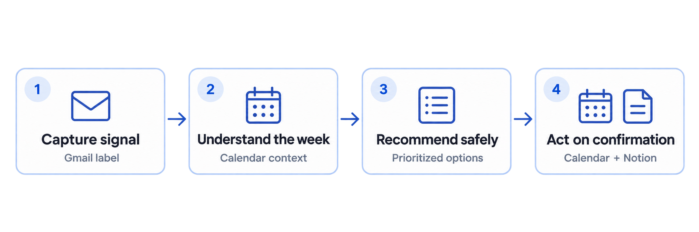
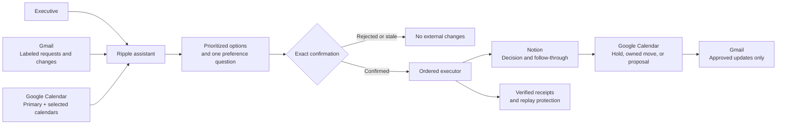

# Ripple — Executive AI Scheduling Assistant

**Ripple turns a crowded executive week, incoming requests, and last-minute changes into prioritized decisions—and carries the approved plan through Gmail, Google Calendar, and Notion.**

It is not another calendar chatbot and it is not a travel-booking copilot. Ripple acts like an executive scheduling partner: it understands what deserves protection, finds feasible alternatives, asks for missing preferences, and makes the exact approved change while preserving a professional record of what changed and why.

## Demo

[](https://github.com/user-attachments/assets/3a0766c3-77d2-41cf-b7d7-d024e8d785cc)

**[▶ Watch the two-minute demo](https://github.com/user-attachments/assets/3a0766c3-77d2-41cf-b7d7-d024e8d785cc)** · [Google Drive backup](https://drive.google.com/file/d/1fNcU-f8HCfns0Id1CC0tR5bJK17YEtld/view?usp=sharing)



## The problem

An executive calendar is not a collection of interchangeable blocks. A customer escalation should usually outrank an internal review. An investor call may need preparation and recovery time. A meeting request hidden in email may be valuable, but it should not silently become a calendar invitation. Moving a meeting someone else owns requires a different workflow from moving one you own.

Most scheduling tools expose availability. Ripple reasons about **commitments, ownership, priorities, consequences, and permission**.

## What Ripple does

1. Reads a bounded set of deliberately labeled emails and the executive's primary plus selected calendars.
2. Identifies conflicts, tight transitions, missing preparation time, external requests, deadlines, cancellations, and usable openings.
3. Prioritizes the commitments that matter and presents one to three grounded options with trade-offs.
4. Asks a concise clarifying question when duration, timing, participants, or timezone is missing.
5. Shows an immutable preview of every proposed external change.
6. Acts only after explicit confirmation.
7. Verifies the provider result and records the decision, rationale, owners, deadlines, and follow-through in Notion.

Chat is for exploration. The confirmation screen is the authority boundary.

## Three real apps, three distinct jobs

| App | What Ripple reads | What Ripple can change | Why it matters |
|---|---|---|---|
| **Gmail** | Up to five recent messages carrying the configured `RIPPLE/READY` label: sender/reply address, subject, received time, and a bounded plain-text excerpt | Sends only explicitly approved stakeholder updates in supported recovery flows | Email is where requests, cancellations, deadlines, and external changes first appear. The label turns the inbox into a deliberate assistant queue rather than granting broad mailbox autonomy. |
| **Google Calendar** | Merges the primary and selected executive calendars for availability and conflict analysis | Creates approved holds on the selected calendar; moves the original event when the executive is its organizer; sends a separate proposed-time invitation when somebody else owns the event | Calendar ownership changes the correct action. Ripple removes the old block for meetings the executive owns, but never edits another organizer's invitation. |
| **Notion** | Verifies the configured executive-operations destination | Creates durable decision briefs and follow-through trackers with week-at-a-glance context, affected commitments, owners, deadlines, tasks, and a decision log | A busy executive and their human assistant need more than a success receipt. Notion becomes the shared operational memory explaining what changed, why, and what remains open. |

`[RIPPLE TEST]` is not required in an email subject. It only distinguishes synthetic demo fixtures. The `RIPPLE/READY` label is the actual curation boundary.

## Example: a random email becomes a safe scheduling decision

An external contact sends:

> Could we have a 45-minute call this Friday to review the proposal?

After the user applies `RIPPLE/READY`, Ripple:

1. Classifies the message as a meeting request rather than a newsletter or vague outreach.
2. Extracts the requested duration and timing constraint.
3. Compares the request with both executive calendars.
4. Protects higher-priority commitments and proposes genuinely free options.
5. Asks for a timezone or preferred Friday window if either is materially ambiguous.
6. Shows the recipient, exact time, Calendar effect, and Notion record before action.
7. Sends the Calendar invitation and creates the follow-through record only after confirmation.

Applying a label is permission to **consider** an email. It is never permission to invite, move, cancel, or send.

## How Ripple prioritizes the week

Ripple combines explicit user preferences with a conservative executive-assistant policy. The ranking is a decision aid, not an irreversible rule: the user can refine any recommendation before confirmation.

| Default priority | Typical commitments | Ripple's usual treatment |
|---:|---|---|
| **1 — Protect first** | Customer escalations, board meetings, investor commitments, critical external meetings, fixed travel constraints | Preserve the commitment; move flexible work; protect preparation and travel buffers. |
| **2 — Deadline critical** | Launch decisions, earnings preparation, legal or operational deadlines, promised deliverables | Preserve the deadline and create the earliest realistic preparation or follow-through block. |
| **3 — Important coordination** | Leadership reviews, hiring decisions, partner discussions, cross-functional checkpoints | Find a low-disruption slot; surface attendee and timezone trade-offs. |
| **4 — Flexible internal work** | Recurring reviews, internal syncs, optional working sessions | Prefer these as rescheduling candidates when they collide with higher-priority work. |
| **5 — Optional** | Transparent calendar entries, tentative research, declined invitations | Do not allow them to block a better option; retain them only as context when useful. |

## Scheduling and reliability edge cases

| Scenario | How Ripple detects it | Typical handling | What happens after confirmation |
|---|---|---|---|
| Two meetings overlap | Interval comparison across the merged calendars | Protect the higher-priority or externally constrained commitment and offer free alternatives for the flexible one | Executes only the selected plan and records the rationale in Notion |
| Meeting the executive owns must move | Google reports the connected operator as the organizer | Offer alternatives with the same duration | Updates the **same event**, clears the old time, preserves its details, and notifies existing attendees |
| Meeting owned by someone else must move | Google reports another organizer | Do not edit or cancel the original invitation; propose a separate option | Sends the organizer a concise proposed-time Calendar invitation; the original remains until they respond |
| Back-to-back meetings | Less than 30 minutes between commitments | Surface the tight transition and suggest a buffer or a nearby alternative | Creates only the confirmed buffer/hold or owned-event move |
| Important meeting lacks preparation | Priority meeting has insufficient open time before it | Protect a preparation block before moving lower-priority commitments | Adds the approved preparation block and follow-through tasks |
| Cross-timezone request | Email or event timezone differs from the executive's timezone | Show local 12-hour time with morning/afternoon/evening context and preserve the source timezone | Writes timezone-aware Calendar data; no railway-time ambiguity |
| Broad request such as “Friday” | Day is known but useful window or timezone is unclear | Ask one focused preference question | No external write until the answer produces a reviewable plan |
| Labeled meeting outreach | Email explicitly requests a meeting and supplies sufficient constraints | Rank it against the week and offer one to three free slots | Sends a Calendar invitation to the sender only after exact confirmation |
| Newsletter, promotion, or vague outreach | Labeled message contains no concrete scheduling commitment | Classify as informational and suppress executable options | No Calendar, Gmail, or Notion action |
| Deadline or promised commitment in email | Message contains an actionable date or obligation | Recommend preparation or protected follow-through time | Creates the approved hold and Notion tasks; does not invent recipients |
| Cancellation notice | Labeled message or Calendar state reports a cancellation | Recalculate downstream conflicts and surface affected commitments | Produces the approved recovery actions; never claims to rebook travel or services |
| Event is cancelled before execution | Fresh provider read no longer matches the reviewed state | Invalidate the proposal | Nothing is sent or created; Ripple asks the user to refresh |
| Calendar changes after review | Snapshot or event version differs at confirmation/execution | Reject the stale approval and recompute | Zero stale writes |
| Private event | Calendar visibility is private/confidential | Treat it as occupied time while redacting its title and attendees from model context | Private details are never exposed in the UI or assistant prompt |
| Declined or transparent event | Provider status says declined or free/transparent | Exclude it from blocking-time calculations | No unnecessary reschedule |
| Duplicate message or repeated execution | Stable message/action identifiers and persisted idempotency keys match a prior run | Reuse the verified result | Creates zero duplicate pages, events, or messages |
| Notion fails | Required first write is not verified | Stop the workflow | Calendar and Gmail actions are suppressed |
| Calendar fails after Notion succeeds | Calendar provider does not verify the change | Preserve the Notion record and stop safely | Gmail is suppressed; the case remains recoverable |
| Gmail outcome is uncertain | Network loss occurs after send invocation | Mark the outcome for manual review | Ripple does not blindly retry and risk sending twice |
| User selects an option but does not confirm | Proposal remains in review state | Show the exact action preview | No connected app changes |
| User rejects the proposal | Explicit rejection | Close the proposal calmly | No connected app changes |

## The Notion executive-operations workspace

Notion is not used as a raw transaction ledger. It is the handoff surface a human executive assistant can open and understand immediately.

Every confirmed decision brief contains:

- **Week at a glance** — the latest commitment, why it matters, next checkpoint, and owner.
- **At a glance** — status, chosen decision, impact, next deadline, and last update.
- **What changed** — a concise, human-readable explanation.
- **Affected commitments** — the schedule impact and chosen response for each relevant item.
- **Next actions** — editable tasks with owner, deadline, timezone, and status.
- **Decision log** — what was decided, when, and why the original event was moved or preserved.

The parent page groups current-week context, active decision briefs, and travel/recovery records into a professional executive operations hub.

## System architecture



### Contracts that keep modules consistent

| Boundary | Contract | Invariant |
|---|---|---|
| Provider context | Privacy-filtered Calendar snapshot and bounded Gmail notices | Read routes have no writer capability |
| Assistant output | Strict structured scheduling plan | Model output is a recommendation, never an executable command |
| Proposal | Versioned options, assumptions, snapshot hash, and expiry | Selection alone cannot mutate a provider |
| Manifest | Server-built list of exact Notion, Calendar, and Gmail effects | The browser cannot invent or edit action bodies |
| Approval | Proposal version, proposal hash, manifest hash, actor, and expiry | Approval is valid only for the reviewed state |
| Execution | Persisted action journal and idempotency key | Required effects execute in order and cannot duplicate on replay |
| Receipt | Provider reference, version, verification state, and safe link | UI success requires provider-backed evidence |

## Safety model

- **Bounded access:** Ripple reads only the configured time window and at most five deliberately labeled messages.
- **Privacy filtering:** private titles, attendees, and raw provider payloads do not enter the model context.
- **No chat-based approval:** typing “yes” or selecting an option cannot execute a change.
- **Ownership-aware actions:** owned meetings are moved in place; third-party meetings receive a separate proposal.
- **Fresh-state validation:** Calendar snapshots, ownership, organizer, event version, and proposal expiry are rechecked.
- **Ordered side effects:** Notion → Calendar → Gmail. A required failure suppresses later actions.
- **Idempotent replay:** repeated execution reuses verified results instead of creating duplicates.
- **Honest degradation:** uncertain outcomes and provider failures remain visible; Ripple never replaces them with a success animation.

## Reliability and evaluation

The repository currently includes **115 automated tests** spanning domain rules, schemas, UI behavior, provider adapters, proposal lifecycle, concurrency, idempotency, stale approvals, privacy, and partial failures.

The evaluation strategy asserts both:

1. **Required final state** — the correct Notion page, Calendar effect, receipt, and status exist.
2. **Forbidden side effects** — no duplicate event, unauthorized recipient, stale write, later-provider call after failure, or mutation during read-only conversation occurred.

Important release scenarios include duplicate input, concurrent confirmation, stale Calendar state, cancelled source events, changed organizers, Notion failure, Calendar failure, uncertain Gmail outcomes, private events, timezone boundaries, and malformed model output.

## Why this is agentic

Ripple is not a fixed three-call automation. Every request can require a different sequence:

- identify whether an email is actionable;
- decide which commitments deserve protection;
- distinguish owned from third-party events;
- determine whether enough information exists to propose a slot;
- ask for a preference or produce alternatives;
- recheck changing external state;
- select the correct tool behavior;
- stop, continue, or escalate based on verified results.

The language model handles interpretation and option framing. Deterministic code owns time calculations, authorization, ownership checks, approval integrity, execution order, and replay safety.

## Two-minute demo

1. **Connect:** briefly show verified Gmail, Google Calendar, and Notion steps.
2. **Understand:** ask Ripple to review the week; show the Monday, Wednesday, and Friday conflicts.
3. **Prioritize:** let Ripple protect the most important commitment and explain one trade-off.
4. **Act safely:** select a reschedule, review the exact Notion and Calendar effects, then confirm.
5. **Prove:** show the original owned event moved—not duplicated—and open the professional Notion decision brief.
6. **Extend:** show the labeled internship email and ask Ripple to include actionable requests in the week.
7. **Close:** replay the approved action and show that no duplicate update is created.

Useful demo prompts:

```text
Review my Monday, Wednesday, and Friday conflicts. Protect the highest-priority commitments and suggest rescheduling options.

Reschedule Leadership hiring review to a free time without changing the board preparation.

Prepare my week and include actionable requests from my Ripple email label.
```

## Run locally

### Requirements

- Node.js 24
- A Google OAuth client with Gmail read/send and Calendar event permissions
- A Notion internal integration shared with the chosen parent page
- An OpenAI API key

### Start

```bash
npm install
cp .env.example .env.local
npm run preflight
npm test
npm run dev
```

Open [http://localhost:3000/welcome](http://localhost:3000/welcome) for onboarding or [http://localhost:3000/workspace](http://localhost:3000/workspace) for the assistant.

Ripple calls the OpenAI Responses API directly. You do **not** need to configure a separate Assistant in the OpenAI console.

### Demo data

```bash
# Create or restore the 22-event executive week and Gmail fixture
npm run seed:demo

# Keep the controlled fixtures present during rehearsal
npm run fixtures:watch

# Remove Ripple-owned demo fixtures while preserving pre-existing events
npm run reset:demo
```

Use `PROVIDER_MODE=real` only with the controlled demo accounts and resources after `npm run preflight` passes. Secrets belong in `.env.local`; real email addresses, tokens, Calendar IDs, and Notion page IDs must never be committed.

## Configuration

| Variable | Purpose |
|---|---|
| `PROVIDER_MODE` | `fake` for deterministic local development or `real` for provider-backed demonstration |
| `GOOGLE_CLIENT_ID`, `GOOGLE_CLIENT_SECRET`, `GOOGLE_REFRESH_TOKEN` | Server-side Google OAuth credentials |
| `GOOGLE_REDIRECT_URI` | OAuth callback registered with Google |
| `GOOGLE_CALENDAR_ID` | Selected calendar for new approved Ripple holds |
| `GMAIL_INGEST_LABEL` | Deliberate Gmail curation boundary, normally `RIPPLE/READY` |
| `NOTION_ACCESS_TOKEN`, `NOTION_PARENT_PAGE_ID` | Verified Notion executive-operations destination |
| `OPENAI_API_KEY`, `OPENAI_MODEL` | Structured scheduling assistant planning |
| `RIPPLE_OPERATOR_EMAIL` | Connected executive account used for ownership and recipient safety |
| `DEMO_STAKEHOLDER_EMAILS` | Controlled recipient allowlist for live demonstration |
| `SESSION_SECRET`, `APP_ENCRYPTION_KEY` | Local session integrity and protected stored state |

See [Integrations and authentication](docs/06-integrations-and-auth.md) for the complete setup guide.

## Hackathon rubric alignment

| Criterion | Weight | Evidence in Ripple |
|---|---:|---|
| **Technical execution** | **30%** | Real Gmail, Calendar, and Notion adapters; structured planning; merged calendars; ownership-aware moves; immutable manifests; ordered execution; verified receipts |
| **Reliability and evaluation** | **25%** | 115 automated tests; stale-state rejection; idempotency; duplicate replay; fault injection; forbidden-side-effect assertions; resettable fixtures |
| **Usefulness** | **20%** | One place to triage scheduling pressure, incoming requests, preparation, priorities, rescheduling, and executive-assistant handoff |
| **Originality** | **15%** | Treats scheduling as accountable decision orchestration across inbox, calendar ownership, and operational memory—not generic availability search |
| **Demo clarity** | **10%** | Four-step visual story, realistic executive week, three visible real apps, one explicit approval boundary, and provider-backed proof |

## Repository guide

| Area | Purpose |
|---|---|
| [`app/`](app/) | Next.js routes and server API endpoints |
| [`components/v2/`](components/v2/) | Onboarding, assistant workspace, proposal, confirmation, and receipt UI |
| [`src/lib/v2/`](src/lib/v2/) | Conversations, scheduling analysis, proposals, approval, and execution services |
| [`src/lib/adapters/`](src/lib/adapters/) | Gmail, Google Calendar, Notion, and deterministic fake providers |
| [`contracts/`](contracts/) | Machine-readable action and approval contracts |
| [`tests/`](tests/) | Domain, contract, UI, provider, safety, and reconciliation tests |
| [`scripts/`](scripts/) | Credential-safe preflight plus demo seed, reset, and maintenance tools |
| [`docs/`](docs/) | Product scope, architecture, UX, testing, integrations, decisions, and demo operations |

Start with:

- [Architecture](docs/03-architecture.md)
- [UX brief](docs/04-ux-brief.md)
- [Testing plan](docs/05-testing-plan.md)
- [Integration and authentication guide](docs/06-integrations-and-auth.md)
- [Module contracts](docs/07-module-contracts.md)
- [Judging scorecard](docs/08-judging-scorecard.md)
- [Two-minute demo plan](docs/10-two-minute-demo.md)
- [Demo operations](docs/13-demo-operations.md)
- [Canonical v2 build plan](docs/15-v2-build-plan.md)

## Current scope and honest boundaries

Ripple can understand scheduling requests, prioritize a week, move operator-owned meetings, create approved holds, propose times to external organizers, and maintain Notion follow-through. It does not purchase travel, accept contracts, infer arbitrary recipients, or silently cancel meetings. Public multi-user OAuth, background Gmail push processing, and enterprise administration remain future work.

The product promise is deliberately narrow and provable:

> **Ripple can think broadly about the week, but it can act only on the exact plan the executive confirms.**
