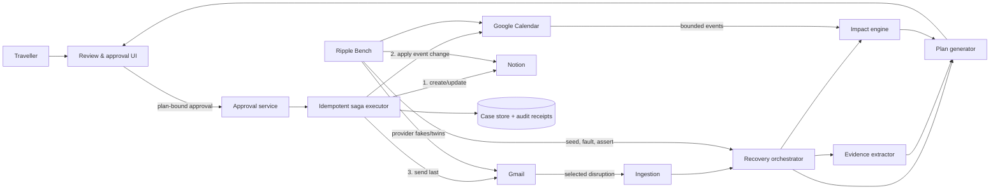
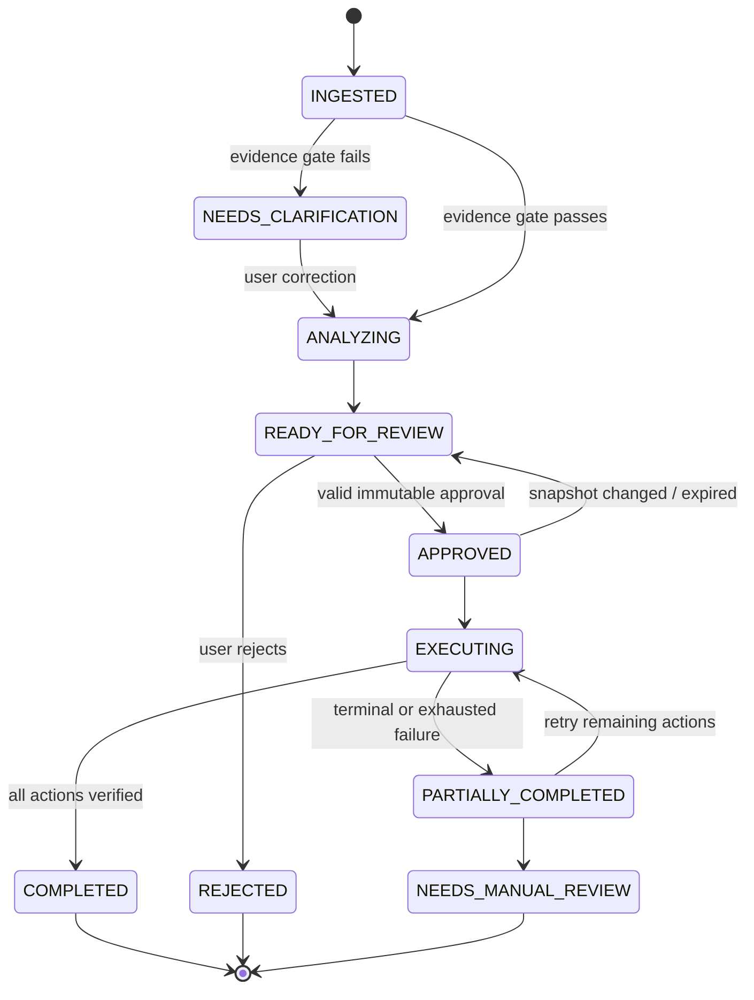

# Architecture

## System context

The diagram’s central rule is simple: reasoning can propose actions, but only a valid approval grant can cross into the executor, and only the executor can call write adapters.

## Runtime components

| Component | Responsibility | Determinism boundary |
|---|---|---|
| Trigger controller | Accept explicit message/label and create case | Deterministic |
| Gmail reader | Fetch bounded thread/message, canonicalize headers/body | Provider-dependent |
| Evidence extractor | Produce schema-valid facts, excerpts, confidence | Model-assisted; schema constrained |
| Evidence gate | Check required fields, contradiction, source support | Deterministic |
| Calendar reader | Fetch bounded window and normalize recurring events | Provider-dependent |
| Impact engine | Apply interval overlap, transfer/buffer, ownership rules | Deterministic |
| Planner | Generate feasible strategy candidates and manifests | Hybrid: deterministic constraints + model explanation |
| Approval service | Hash, actor, expiry, source snapshot validation | Deterministic/security-critical |
| Saga executor | Order writes, enforce idempotency, retry/stop/compensate | Deterministic |
| Artifact adapter | Create/update recovery document | Provider-dependent |
| Calendar writer | Patch owned event or create tentative hold/note | Provider-dependent |
| Gmail writer | Create draft/send approved MIME content | Provider-dependent |
| Receipt verifier | Read-after-write when possible; persist evidence | Provider-dependent |
| Bench | Seed state, inject faults, assert state and traces | Deterministic harness |

## Case state machine

No transition may skip `APPROVED`. A completed action is never executed again; a changed plan returns to review and receives new action IDs and hashes.

## Write saga

| Order | Action class | Reason | Failure behavior |
|---:|---|---|---|
| 1 | Create/update Notion recovery page | Durable, visible coordination record; easiest to amend | Stop, retry; no later actions |
| 2 | Calendar create/patch | Consequential but inspectable/reversible | Stop before email; retry or compensate if safe |
| 3 | Gmail create draft/send | Most socially irreversible | Execute only after prior receipts verified; never auto-resend ambiguous timeout |

For Gmail send timeouts where the provider outcome is unknown, reconcile using the action marker/message query before retrying. “Unknown” is a first-class state, not treated as failure.

## Data model

- `RecoveryCase`: identity, owner, state, source snapshot, active plan, approvals, receipts.
- `SourceMessage`: provider IDs, canonical headers, sanitized text, received time, content hash.
- `DisruptionFacts`: affected segment, status, temporal facts, locations, evidence, confidence.
- `CalendarEventSnapshot`: event ID/etag, UTC interval, IANA timezone, attendees, ownership, hash.
- `ImpactAssessment`: event classification, rule, buffer, explanation, severity.
- `RecoveryPlan`: version, strategy, assumptions, outcomes, action manifest, risk flags.
- `ActionManifest`: ordered typed actions and global manifest hash.
- `ApprovalGrant`: actor, plan version, snapshot/manifest hashes, issue/expiry, nonce, consumed time.
- `ExecutionReceipt`: per-action attempt, result, provider reference, verification, before/after hashes.

## Trust boundaries and safeguards

1. **External content is untrusted.** Email bodies and calendar descriptions are data, never instructions; prompt delimiters and strict schemas isolate them.
2. **Model output is untrusted.** Validate schema, provenance, allowlists, recipients, ownership, and impact limits before preview.
3. **Approval is a capability.** Store server-side; bind to user/case/version/hashes/TTL/nonce; consume once.
4. **Credentials remain server-side.** Encrypt refresh tokens; redact logs; never expose tokens to model or browser.
5. **Writes are allowlisted.** Only declared action types, resources in the snapshot, and recipients visible in preview may execute.
6. **Observability is privacy-aware.** Trace hashes, timing, provider status, and error categories; raw message text is opt-in and ephemeral.

## Deployment profiles

| Profile | Purpose | Providers |
|---|---|---|
| `bench` | deterministic CI and adversarial tests | In-memory fakes or Arga twins when available |
| `demo` | dedicated test user and seeded data | Real Gmail, Google Calendar, Notion; OpenAI project key |
| `prod-future` | multi-user service | OAuth per user, encrypted store, queues/webhooks, policy/admin layer |

## Observability contract

Every trace/span includes `trace_id`, `case_id`, `module`, `operation`, `attempt`, `duration_ms`, `outcome`, and optional `action_id`; it excludes message bodies, tokens, attendees, reservation codes, and model chain-of-thought. Metrics include workflow completion, time-to-review, extraction corrections, stale approvals, duplicate-prevention count, provider failure rate, and forbidden-effect count.
