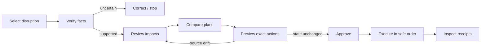

# UX brief

## Experience goal

Ripple should feel like a calm incident commander. It is a decision surface, not a chat-first assistant: facts, consequences, choices, exact actions, approval, and receipts remain visible together.

For the hackathon presentation, the same workspace has a focused demo composition and presenter controls. The exact choreography, explanatory UI, and honesty constraints are defined in [the two-minute demo plan](10-two-minute-demo.md).

## Visual direction

The product should look like a restrained modern work tool, not a themed travel dashboard.

- Use a neutral white/graphite foundation with thin dividers and generous whitespace.
- Use one restrained indigo accent for selection, evidence, and focus. Never wash the interface in the brand color.
- Reserve red, amber, and green strictly for failure/risk, warning, and verified outcomes.
- Prefer one continuous workspace with typographic sections over a grid of floating cards.
- Use system/Inter-style typography, medium-weight headings, sentence case, and compact metadata.
- Use icons only to identify Gmail, Google Calendar, Notion, or an action type; avoid oversized illustrations and decorative badges.
- Keep radius and shadow subtle: one product shell, shallow inset surfaces only where interaction needs containment.
- Avoid gradients, glass effects, saturated backgrounds, emoji, novelty travel imagery, and multiple competing accent colors.
- Let the consequence headline and exact action list carry the visual hierarchy.

## Primary flow

## Information architecture: one case workspace

Avoid a generic dashboard for P0. Use a single vertically-scannable case page with a sticky case status and one primary action at a time.

### 1. Case header

- Route/property and disruption type: “BER → SFO · flight cancelled.”
- Status: Needs review, Ready to review, Approval expired, Executing, Completed, Partial failure.
- Visible `Synthetic` or `Live test` label.
- Case version and “last checked” time.
- Source link back to Gmail.

### 2. What changed

- Side-by-side original and revised facts.
- Local time, timezone abbreviation, and UTC only in expanded detail.
- Field-level confidence: use plain text (“Verified from email”, “Needs confirmation”), not a decorative percentage alone.
- Each consequential fact expands to a short source excerpt and message timestamp.
- Correction control for carrier/segment/status/times; correction creates a new case version.

### 3. What this affects

- Chronological trip-and-calendar timeline.
- Each commitment shows severity, owner/organizer, current time, and causal explanation.
- Preferred explanation pattern: “Arrival moved 95 min; required transfer buffer is 60 min; meeting begins 40 min after arrival → short by 20 min.”
- Private events retain only availability and title visibility permitted by provider response.
- Unaffected events are collapsed by default but count remains visible.

### 4. Response plans

Show two or three plans on a shared comparison dimension:

| Dimension | Example content |
|---|---|
| Strategy | Notify and preserve; add recovery buffer; suggest manual reschedule |
| Addresses | Which risks this plan mitigates |
| Leaves unresolved | Manual booking, unowned meeting changes |
| People contacted | Named, deduplicated recipients |
| Calendar effects | Creates a hold/note; never silently moves third-party events |
| Assumptions | Clearly unverified statements |

Default recommendation must have a reason, not merely a badge. Avoid fake fares, seat counts, or “confirmed” alternatives.

### 5. Exact action preview

This is the control boundary. Render the canonical manifest, grouped in execution order:

1. **Notion:** page title, created/updated status, and section-level diff.
2. **Google Calendar:** exact owned event/hold, before/after values, attendees affected.
3. **Gmail:** exact `to`, `cc`, subject, and full message body.

Show plan expiry and a summary such as “Approve 3 actions. Nothing else is authorized.” The Approve button must require an authenticated user gesture; double-clicks disable immediately. “Edit” returns to a new plan version. “Reject” ends without writes.

### 6. Execution timeline

Each row uses: action label → status → timestamp → plain-language receipt → safe next action.

Statuses: Planned, In progress, Verified, Failed—safe to retry, Outcome unknown—check manually, Skipped, Compensated. Never show “Success” before read-after-write verification where supported.

### 7. Reliability proof

A compact drawer/section shows benchmark pass count and the three strongest invariants:

- no action without exact approval;
- no duplicate effects on replay;
- no email after an earlier saga failure.

The full scenario report can open separately; it must use the same receipts as the product flow, not a disconnected test UI.

## Screen states and required behavior

| State | User message | Available action |
|---|---|---|
| Empty | “Label a disruption email, then scan.” | Scan / load demo fixture |
| Analyzing | “Checking the notice and calendar…” | Cancel read-only run |
| Needs review | Name missing/contradictory facts and why they matter | Correct facts / dismiss |
| Ready for review | “Two feasible response plans.” | Select plan |
| Awaiting approval | Exact action count and expiry | Approve / edit / reject |
| Stale | “Calendar changed after this preview.” | Re-analyze; no approve |
| Executing | Current ordered action and completed receipts | No duplicate trigger |
| Completed | “3 of 3 actions verified.” | Open outputs |
| Partial failure | Name completed and blocked actions | Retry remaining / reconcile |
| Unknown outcome | “Gmail did not confirm whether this sent.” | Open Gmail / mark reconciled |
| Auth lost | Name connector and preserve completed work | Reconnect / stop |

## Copy and truthfulness rules

- Use “suggested recovery step” unless an external provider verified it.
- Use “draft notification” until Gmail confirms a sent message ID.
- Use “at risk” rather than “conflict” when a buffer policy, not overlap, causes the flag.
- Separate `Known`, `Assumed`, and `Needs confirmation`.
- Say which app failed and what did or did not happen.
- Mask reservation codes and email addresses outside the approval screen.
- Never display chain-of-thought; provide concise evidence and rule-based explanations.

## Accessibility and responsive behavior

- Fully operable by keyboard in logical document order; focus moves to validation errors and execution status changes.
- Use semantic headings, lists, buttons, forms, tables, and `aria-live="polite"` for execution receipts.
- Do not encode risk or status by color alone; pair with label/icon.
- Meet WCAG AA contrast; preserve visible focus; support 200% zoom.
- At narrow widths, stack original/revised and plan comparisons; keep exact email preview readable without horizontal scrolling.
- Dates include weekday and timezone; avoid ambiguous numeric-only dates.
- Destructive or socially irreversible actions use direct verbs and explicit subjects/recipients.

## UX acceptance tests

- A first-time user can identify the source evidence, most affected commitment, recommended plan, and exact outbound recipients without opening developer details.
- No control implies paid rebooking or autonomous meeting rescheduling.
- An expired/stale plan has no enabled Approve action.
- Editing any manifest field visibly increments the plan version and requires reapproval.
- Partial success never collapses into a generic error toast.
- Synthetic data is visibly identified in the case, output Doc, and benchmark.
