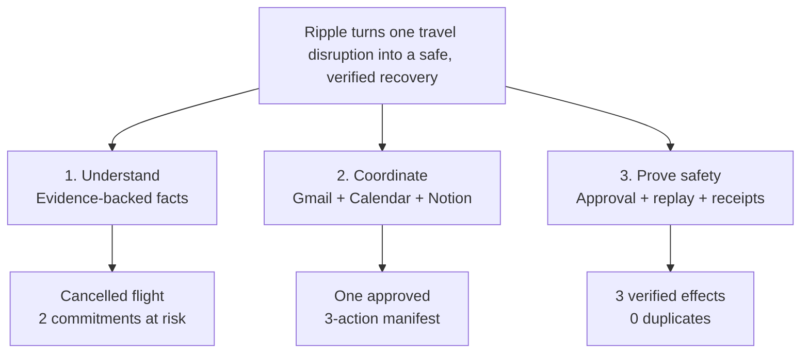

# Two-minute demo plan

## The governing thought

> **Ripple understands what broke, coordinates the consequences across three apps, and proves that it acted safely.**

This is the entire demo. Every visible element must support one of those three claims. Do not tour features, architecture, settings, or code.



## The two-minute story

### The scenario

Use one sharp, comprehensible fixture:

- Flight BER → SFO is cancelled.
- The traveler will miss a customer meeting and has too little buffer for a workshop.
- Ripple recommends a remote-first recovery: create/update a recovery brief, add a travel-disruption Calendar hold, and notify the two affected stakeholders.
- Replaying the same notice creates zero additional effects.

Avoid multiple legs, hotel changes, uncertain dates, live flight search, or more than two impacted commitments in the main demo. Those belong in the benchmark.

## Timed choreography and script

| Time | Screen/action | Narration | Claim proved |
|---:|---|---|---|
| 0:00–0:10 | Start on Ripple’s already-analyzed case. Large headline: **“Flight cancelled → 2 commitments at risk.”** Small source link shows Gmail. | “A cancelled flight is obvious. What is not obvious is everything else it breaks.” | Hook/usefulness |
| 0:10–0:28 | Reveal the **What changed** strip: old flight, cancelled status, exact quoted evidence. Then highlight two red/amber events on the impact timeline. | “Ripple reads the notice in Gmail, cites the exact evidence, and checks the traveler’s calendar. This customer meeting is impossible; this workshop has only a 20-minute buffer.” | Understands correctly |
| 0:28–0:45 | Show two plans; the recommended **Remote-first recovery** is selected. Keep comparison to three rows: resolves, leaves manual, actions. | “It proposes two recovery strategies. It never pretends it can buy a flight—the recommendation is about coordinating the blast radius.” | Useful/original scope |
| 0:45–1:03 | Open the exact-action drawer with a three-row manifest: **Notion 1 · Calendar 1 · Gmail 1**. Recipients and calendar time are visible. Click **Approve these 3 actions**. | “Before anything changes, I see the exact recovery page, calendar, and email effects. This approval is valid only for this plan and this current calendar snapshot.” | Control/safety |
| 1:03–1:25 | Execute. Animate one vertical receipt rail in real order: Notion ✓ → Calendar ✓ → Gmail ✓. Do not wait on spinners; pre-warm and target <7 seconds. | “Ripple writes the recovery brief first, applies the calendar hold second, and sends email last. Each step is verified before the next begins.” | Technical execution |
| 1:25–1:40 | Click the three receipt links or show a prepared 3-up browser view for 3–4 seconds: Notion recovery page, Calendar hold, sent Gmail message. Return immediately. | “The three apps now agree, and these are provider receipts—not a success animation.” | Real multi-app result |
| 1:40–1:54 | Click **Replay same notice**. A result appears: **0 new actions · duplicate safely ignored**. Beside it show **12/12 safety scenarios passed** with three named checks. | “And if Gmail delivers the notice twice, Ripple does nothing twice. The same bench also checks stale approvals and partial provider failures.” | Reliability/evaluation |
| 1:54–2:00 | Return to final state: **Recovered · 3 verified · 0 duplicates**. | “Ripple does not just act across apps. It can show why the action was safe.” | Memorable close |

Target spoken script: 185–220 words. Target functional runtime: 90 seconds, leaving 30 seconds of safety margin for clicks and network variance.

## The demo screen

Use one stage-like workspace, not a dashboard. The audience should understand it even with the sound off.

Visual tone: polished and neutral—white/graphite surfaces, one restrained indigo accent, thin separators, and semantic risk colors only. Do not use a green-tinted theme, decorative gradients, glassmorphism, or a grid of rounded cards.

```text
┌────────────────────────────────────────────────────────────────────────────┐
│ RIPPLE                         RECOVERED · LIVE TEST             01:34 ago │
│ Flight cancelled → 2 commitments at risk                                  │
│ Gmail source  →  Google Calendar impact  →  Notion recovery page           │
├────────────────────────────────────────────────────────────────────────────┤
│ WHAT CHANGED                  │ BLAST RADIUS                                │
│ BER 08:10 → SFO 11:20         │ ● 14:00 Customer meeting — impossible       │
│ CANCELLED                     │ ◐ 16:00 Workshop — 20m buffer               │
│ “Your flight has been…”       │                                              │
├────────────────────────────────────────────────────────────────────────────┤
│ RECOMMENDED: REMOTE-FIRST RECOVERY                                          │
│ Resolves: customer communication + calendar visibility                     │
│ Manual: choose/rebook replacement travel                                   │
│                                                                            │
│ EXACT ACTIONS                         EXECUTION RECEIPTS                     │
│ 1  Notion       Update recovery brief  ✓ Verified                          │
│ 2  Calendar     Add disruption hold    ✓ Verified                          │
│ 3  Gmail        Notify 2 people        ✓ Verified                          │
│                                                                            │
│ [Approve these 3 actions]              0 duplicates on replay               │
└────────────────────────────────────────────────────────────────────────────┘
```

At each beat, visually emphasize only the relevant region and de-emphasize the rest. Do not scroll during the main story.

## UI elements added primarily for comprehension

These are legitimate “show-business” elements because they explain real state. They must never fabricate a result.

### 1. Consequence headline

Large, outcome-shaped title: **“Flight cancelled → 2 commitments at risk.”** This is stronger than “Case #204 ready.” It compresses trigger and value into one glance.

### 2. Three-app story rail

Persistent but quiet rail: **Gmail source → Calendar impact → Notion recovery**. During execution it becomes a progress rail and ends with provider receipt links. It makes the cross-vendor three-app requirement visible without explaining integrations.

### 3. Evidence underline

Clicking a fact briefly highlights its exact source excerpt. This turns “AI extraction” into visible proof in two seconds.

### 4. Blast-radius timeline

Put the changed arrival and two calendar events on a single time axis. Show the missing buffer numerically. This explains why an event is at risk faster than prose.

### 5. Exact-action counter

The approval button says **“Approve these 3 actions”**, not “Continue.” A compact counter above it says **Notion 1 · Calendar 1 · Gmail 1**. This makes scope control tangible.

### 6. Approval seal

After approval, show a small non-technical line: **“Locked to this plan and calendar snapshot.”** Do not show a SHA hash unless a judge opens technical detail.

### 7. Receipt rail

One ordered vertical animation shows `Verified` states, provider icons/names, and elapsed time. Use the actual action journal. A receipt link opens the real external object.

### 8. Safety proof strip

End with only three high-signal checks:

- Duplicate notice → 0 new actions.
- Calendar changed → approval rejected.
- Calendar API failed → email not sent.

Show the broader pass count nearby, but do not scroll through a test suite.

## Demo-only controls and honesty rules

Demo helpers are encouraged if clearly separated from product claims:

- **Load demo scenario** seeds sanitized data; label the case `DEMO DATA` or `LIVE TEST`.
- **Replay same notice** reissues the real trigger and reports observed side effects.
- **Reset demo** is hidden from the main stage or placed in a presenter toolbar.
- **Fast execution animation** may skip idle wait visually, but receipts must come from real completed calls. Never pre-check actions before provider confirmation.
- A prepared three-app browser arrangement is acceptable; do not use static screenshots while claiming live actions.
- The benchmark count must come from a saved run tied to a code/fixture version and timestamp.

## What not to put on the main screen

- Architecture diagram, state-machine terminology, raw JSON, API latency dashboard, token usage, logs, hashes, confidence decimals, model name, or framework logos.
- More than two plans, two impacted commitments, or three approved actions in the golden path.
- A generic chat box, navigation sidebar, settings, inbox list, or feature cards.
- “AI-powered,” “autonomous,” “multi-agent,” or sponsor-flattering copy as a substitute for evidence.
- Live flight alternatives, fares, or purchase UI.

These can exist behind **Technical details** or in Q&A.

## Presenter mechanics

### Before recording/live judging

1. Use 125–150% browser zoom and hide bookmarks/notifications.
2. Seed a synthetic Gmail thread, owned demo calendar events, and an empty Notion demo parent page.
3. Authenticate and pre-warm all providers; confirm token refresh.
4. Keep the final three provider tabs open and ordered for rapid verification.
5. Reset and rehearse the exact fixture three times with a stopwatch.
6. Record a clean backup run and screenshots of the final provider states.
7. Close all personal tabs and use synthetic identities/reservation references.

### Failure choreography

- If a real call takes >5 seconds: narrate the safe ordering, then show the last verified receipt.
- If a provider fails: use it as evidence—show that later actions stopped—then switch to the clean backup result.
- If auth is lost: do not debug on stage. State “Ripple failed closed; here is the recorded successful run.”
- If the benchmark is slow: show the saved versioned result, then run only duplicate replay live.

## Pyramid-principle Q&A answers

Lead with the answer, then at most three supports:

- **What is novel?** Ripple coordinates the blast radius of disruption; it does not imitate a booking site. It connects evidence, downstream obligations, and safe action.
- **Why is it an agent?** Inputs and consequences vary; Ripple extracts, reasons over constraints, chooses a plan, rechecks changing state, and executes conditionally. Authorization and time math remain deterministic.
- **How do you know it works?** We assert final provider state and forbidden effects across resettable scenarios. Duplicate input, stale approval, and partial failure are first-class tests.
- **Why human approval?** The actions are socially consequential and state can change between recommendation and execution. Approval is bound to the exact plan the user reviewed.
- **Why no automatic rebooking?** We did not have a verified transaction sandbox or servicing contract. We chose a narrower claim we can prove end to end.

## Demo definition of done

- First frame communicates disruption, consequence, and product name in under three seconds.
- At no point are more than three visual facts competing for attention.
- All three apps are visually named before minute one and shown with real results.
- One click visibly crosses the approval boundary.
- Duplicate replay produces zero new provider objects/messages.
- Every metric/result is derived from actual case/bench data.
- Three consecutive rehearsals finish in ≤1:50, leaving ten seconds of contingency.
