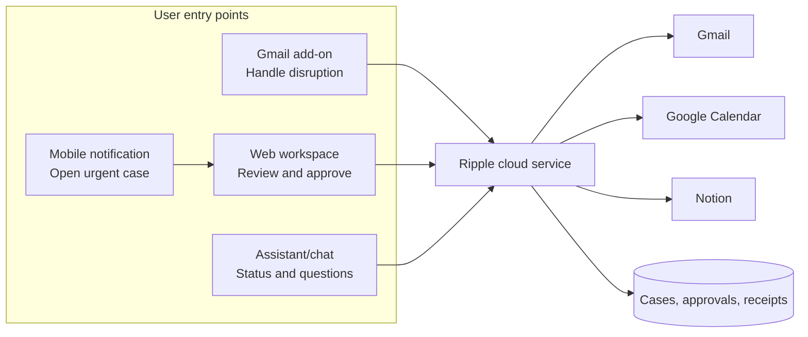

# Product form and utility strategy

## Decision

Ripple should be a **cloud application with a focused web workspace**, eventually entered from a **Google Workspace add-on inside Gmail**. It should not be architected as a Chrome extension, and a conversational assistant should be a secondary interface rather than the product’s only interface.

For the hackathon, build only the web workspace and durable backend. Use one pre-authorized demo account and a manual “analyze this labeled message” trigger. The Gmail add-on, push monitoring, mobile notifications, and public onboarding are post-hackathon surfaces over the same backend contracts.

## Why this is the right product shape

The backend is the product’s system of record. Surfaces only capture intent and render state; they do not own orchestration, credentials, approvals, or retries.

## Form-factor comparison

| Option | Strength | Limitation | Decision |
|---|---|---|---|
| Standalone web app | Best for evidence, impact timeline, plan comparison, exact approval, receipts, and cross-device access | User must open it from Gmail/notification | **Core product and hackathon UI** |
| Google Workspace/Gmail add-on | Appears beside the disruption message; excellent “Handle this disruption” entry point and can assist draft composition | Card-based UI is constrained; contextual triggers fire broadly; still needs backend for durable workflows | **Best post-hackathon entry surface** |
| Chrome extension | Fast browser overlay and side panel | Browser-specific, weaker on mobile, Web Store/permission friction, short-lived service-worker lifecycle, poor place for durable background orchestration | **Do not use as core; optional prototype launcher only** |
| Conversational assistant | Natural for “What changed?” and status questions | Weak for comparing exact side effects, editing recipients/times, durable approvals, and partial-failure receipts | **Secondary interface after core is reliable** |
| Native mobile app | Timely alerts and approvals | Largest build/distribution cost; duplicates web surface | **Later; start with mobile web/push link** |

## Real-world user experience

### Immediate-use path

1. User opens a cancellation/delay email.
2. Gmail add-on shows **Handle disruption with Ripple**.
3. Ripple opens a case in the web workspace with source evidence already attached.
4. The user reviews blast radius and chooses a recovery plan.
5. Exact actions are approved once.
6. Ripple executes and returns provider receipts.
7. Gmail add-on later shows the case status and a link back to full details.

### Proactive path, later

1. Backend watches a user-selected Gmail label or narrow query through Gmail push notifications.
2. A qualifying notice creates a read-only analysis; it never writes automatically.
3. User receives an email/push notification: “Flight cancelled; two commitments may be affected.”
4. The approval link opens the same web workspace.

The proactive path needs a continuously available backend. Gmail push uses Google Cloud Pub/Sub, and mailbox watches must be renewed; it is not a good hackathon dependency.

## How to maximize utility

### 1. Meet the user at the moment of disruption

The highest-leverage surface is a Gmail-native action on the actual message. Avoid asking users to forward mail, paste text, or start a generic chat.

### 2. Solve the blast radius, not travel shopping

Focus on the coordination burden commercial booking products handle poorly:

- What commitments became impossible or risky?
- Who needs to know, and what should each person receive?
- Which calendar holds, buffers, or reminders should change?
- Where is the living recovery plan?
- What completed, failed, or remains manual?

This remains useful regardless of airline, booking channel, or corporate travel provider.

### 3. Offer graduated autonomy

| Mode | Behavior | Appropriate stage |
|---|---|---|
| Observe | Explain disruption and impact; no writes | Default onboarding |
| Draft | Create proposed Calendar/artifact/email changes | Early real-world use |
| Approve | Execute one exact plan after review | Hackathon and recommended product default |
| Policy auto-action | Automatically perform narrowly pre-approved reversible actions | Later, only with proven reliability |

Trust can grow without forcing users to grant open-ended autonomy.

### 4. Make corrections improve future cases

Store user-approved preferences, not hidden behavioral guesses: home timezone, minimum arrival buffer, VIP/customer priority, draft tone, work hours, and allowed Calendar action types. Keep every preference visible and editable.

### 5. Design for the whole disruption lifecycle

After the initial response, one case should accept revised notices, cancellations of prior updates, and manual resolution. It should keep the Doc, Calendar, and communications consistent without creating a new disconnected case.

### 6. Make reliability visible

Users need a compact receipt: which app changed, exact object, time, verification, and remaining manual step. “Completed” without provider evidence is not sufficient.

### 7. Expand by disruption type, not by adding random apps

After flight delay/cancellation is reliable, add rail cancellation, hotel change, missed connection, and ground-transfer risk through the same fact/impact contracts. Add integrations only when they close a real recovery loop.

## Hackathon P0: the buildable cut

The official build window is approximately 6.5 hours. The P0 must be one narrow vertical slice:

### Include

- One local web page: evidence → two impacts → two plans → exact approval → receipts.
- One Google test user already authorized before the build/demo.
- Manual scan of one dedicated Gmail label; no background watcher.
- Flight cancellation and simple delay fixtures only.
- One bounded Calendar window and deterministic buffer rules.
- Calendar writes limited to one agent-owned disruption hold/note.
- One case-owned Notion recovery page under the dedicated demo parent.
- One approved Gmail notification sent last to controlled recipients.
- Immutable plan/snapshot approval and idempotency keys.
- Eight high-signal reliability scenarios using scripted adapters.
- Live smoke test for the golden path plus deterministic replay for evaluation.

### Exclude

- Chrome extension or Gmail add-on packaging/review.
- Gmail Pub/Sub push, queues, recurring watch renewal, and proactive notifications.
- Public/multi-user OAuth onboarding and account settings.
- Live flight search, prices, booking, payments, cancellation, or refunds.
- Automatic editing/cancellation of third-party meetings.
- Mobile app, chat assistant, Google Docs fallback adapter, rail/hotel flows, and preference learning.
- General-purpose agent loop or multiple autonomous sub-agents at runtime.

## Six-and-a-half-hour execution budget

| Elapsed | Deliverable | Cut rule |
|---:|---|---|
| 0:00–0:35 | Freeze fixture, schemas, states, fake ports, and demo copy | No styling or extra scenarios |
| 0:35–1:25 | Gmail selected-message read + structured extraction/evidence | If OAuth blocks, keep live adapter smoke separate and continue with fixture |
| 1:25–2:10 | Calendar read + deterministic two-event impact | Support one timezone pair; test DST separately in bench |
| 2:10–2:55 | Two recovery plans + exact action manifest + approval hash | No free-form planner loop |
| 2:55–4:15 | Notion → Calendar → Gmail executor with journal/idempotency | Draft-only Gmail is acceptable fallback; preserve ordering/receipts |
| 4:15–5:10 | Eight benchmark scenarios and compact scorecard | Prioritize approval, duplicate, stale state, and partial failure |
| 5:10–6:00 | Finished single-screen UI and provider receipt links | Build only critical screen states |
| 6:00–6:30 | Reset, three rehearsals, recording, short reliability brief | Freeze features; fix only demo blockers |

## Scope kill-switches

Use these decisions automatically if the clock slips:

1. If Google OAuth is not working by 1:00, run the product through scripted adapters while one isolated live-auth track continues; never let auth block the UI/reliability spine.
2. If all three writes are not stable by 4:15, make Gmail draft creation the final action rather than send, if rules permit.
3. If model extraction is unstable, constrain the golden path to one schema/fixture and show ambiguity handling in the bench.
4. If UI polish is late, keep only the one demo workspace; remove settings, inbox, case list, and technical-detail screens.
5. If live APIs are unreliable during judging, show the saved real provider receipts and run duplicate/stale behavior against the deterministic environment—clearly labeled.

## Architecture rule that preserves the future

Do not put business logic in a browser extension, Gmail add-on, or chat prompt. All surfaces call the same backend commands:

- `create_case_from_message`
- `analyze_case`
- `select_plan`
- `approve_manifest`
- `execute_approved_plan`
- `get_case_and_receipts`

This makes the hackathon web UI disposable without making the product prototype disposable.

## Success test

The scope is correct if the team can say:

> “Today we built the reliable core and the best screen for understanding and approval. In production, the user starts it beside the Gmail message; the same backend continues working even after the browser closes.”
