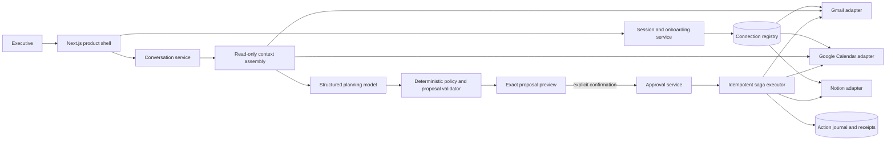

# Ripple v2 — software architecture and incremental build plan

Status: implementation proposal; no production code changed  
Owner: Senior Software Engineer / Architect  
Inputs: v1 implementation, v1 safety contracts, `docs/14-onboarding-v2-spec.md`, onboarding mockups, and the v2 product request

## 1. Engineering outcome

V2 turns Ripple from a single travel-recovery demonstration into a resumable assistant product with three connected capabilities:

1. a five-step setup flow whose success states are backed by real server-side provider verification;
2. a conversational workspace that can explore scheduling ideas without making changes;
3. an exact proposal-and-confirmation boundary that reuses v1's approval, journal, receipt, and replay guarantees before Calendar, Notion, or Gmail can be changed.

Notion becomes the executive follow-through surface, not an execution ledger. Each approved recovery or scheduling plan maintains a living action list with task, owner, due date, and status. Technical receipts remain in Ripple's private store and are not presented as the Notion product experience.

The architecture preserves the strongest v1 invariant:

> A model may suggest actions, but only a versioned, immutable proposal explicitly confirmed by the signed-in user can cross into the write executor.

## 2. Scope decision: real connections without dishonest OAuth theatre

### Recommended hackathon v2

Use the real credentials already configured on the server and verify each integration during onboarding:

- Gmail: call the Gmail profile endpoint and perform a bounded label/read capability check; show the masked returned identity.
- Google Calendar: list available calendars, confirm a selected writable calendar, and perform a bounded read.
- Notion: retrieve the configured parent page, retrieve the current bot/workspace identity, and verify that the destination is shared with the integration. Use a reversible capability probe only in a dedicated demo workspace; otherwise verify read access and defer write proof to the guided example.

The onboarding buttons may retain the product wording **Connect Gmail**, **Connect Calendar**, and **Connect Notion**, but the client must enter its success state only after these server checks pass. A timed animation is presentation only and can never set `CONNECTED`.

This is genuine integration for the single demo operator, not self-service OAuth. The UI should say **Connected as…** or **Connected to…**, never imply that the browser completed a new provider authorization when it did not.

### Feasible real OAuth work

| Flow | Feasibility in v2 | Recommendation |
|---|---|---|
| Google sign-in (`openid email profile`) | Moderate; requires sessions, callback validation, and a user store | Implement only if multi-session sign-in is essential to judging |
| Gmail + Calendar authorization | Moderate; Google can issue one grant containing both scope groups | Optional v2.1; use one Google authorization round trip, then verify Gmail and select Calendar in separate product steps |
| Progressive Gmail then Calendar consent | Possible but brittle under hackathon time: incremental scopes, refresh-token rotation, and cancellation recovery | Defer; it adds risk without increasing provider count |
| Notion public OAuth | High setup and integration cost; requires a public integration, redirect URI, code exchange, workspace selection, token storage, and installation lifecycle | v3 |
| Existing Notion internal integration | Already available and real for one workspace | v2 default |

If Google OAuth is implemented, use Authorization Code flow with PKCE, server-generated `state`, `access_type=offline`, and a server-only callback. Store encrypted refresh tokens by user/provider. Never send tokens, client secrets, raw scopes, or authorization codes to React state, logs, URLs after callback, analytics, or the model. Notion's existing internal token must remain server-side.

## 3. System shape



The setup service can read providers but cannot perform business writes. The conversation service can read and propose but cannot call writer ports. Only the executor receives writer ports.

## 4. Bounded contexts and module contracts

### 4.1 Identity and session

```ts
interface UserSession {
  session_id: string;
  user_id: string;
  primary_email_masked: string;
  issued_at: string;
  expires_at: string;
}
```

- An HTTP-only, `Secure` in deployed environments, `SameSite=Lax` cookie carries an opaque session reference.
- Server routes derive `user_id`; clients cannot supply or override the approval actor.
- For the single-operator hackathon profile, the session may be bootstrapped from server configuration, but it must still be represented as a server-owned session rather than a client constant.
- CSRF protection is required on connection callbacks and all consequential POST routes.

### 4.2 Resumable onboarding

```ts
type OnboardingStep = "ACCOUNT" | "GMAIL" | "CALENDAR" | "NOTION" | "COMPLETE";
type ConnectionStatus =
  | "NOT_STARTED"
  | "CHECKING"
  | "CONNECTED"
  | "NEEDS_ATTENTION"
  | "DISCONNECTED";

interface ConnectionSummary {
  provider: "GMAIL" | "CALENDAR" | "NOTION";
  status: ConnectionStatus;
  identity_label?: string;       // already masked/safe for the UI
  selected_resource_id?: string; // opaque server reference, not a token
  selected_resource_label?: string;
  capabilities: string[];
  verified_at?: string;
  error_code?: ConnectionErrorCode;
}

interface OnboardingProfile {
  schema_version: "2.0";
  user_id: string;
  version: number;
  current_step: OnboardingStep;
  completed_steps: OnboardingStep[];
  connections: ConnectionSummary[];
  created_at: string;
  updated_at: string;
}
```

Canonical state lives on the server and is saved after every verified step. Refreshing or returning from a provider callback resumes at the first incomplete required step. Back navigation does not disconnect anything. A provider connection is stale when `verified_at` exceeds the chosen TTL or a live probe returns `AUTH`, `PERMISSION`, or missing capability; stale connections become `NEEDS_ATTENTION`, never silently `CONNECTED`.

Allowed step transitions:

```text
ACCOUNT -> GMAIL -> CALENDAR -> NOTION -> COMPLETE
```

A user may view an earlier step, but completion can advance only when every preceding required step is complete. Setup completion is a derived condition, not a client flag.

### 4.3 Provider capability verification

Add a read-only port separate from business writers:

```ts
interface ConnectionVerifierPort {
  verify_identity(): Promise<ProviderIdentity>;
  verify_capabilities(required: string[]): Promise<CapabilityResult>;
  list_selectable_resources?(): Promise<SelectableResource[]>;
  verify_resource?(resource_ref: string): Promise<ResourceVerification>;
}
```

Provider-specific minimums:

- Gmail: authenticated profile email matches the expected operator; label list/read works; required read and send capabilities are present. Do not send a probe email.
- Calendar: selected calendar exists; read access succeeds; writable status is confirmed from access role. Do not create an event during ordinary onboarding.
- Notion: bot/workspace identity is returned; selected parent page can be retrieved; parent matches the configured/shared destination. A write probe, if enabled for the demo workspace, creates a clearly marked child and immediately archives it, with a receipt and cleanup fallback.

Verification returns normalized errors only: `AUTH_REQUIRED`, `PERMISSION_MISSING`, `RESOURCE_NOT_SHARED`, `RESOURCE_READ_ONLY`, `PROVIDER_UNAVAILABLE`, or `CONFIGURATION_MISSING`. Raw SDK errors and provider payloads do not cross the adapter boundary.

### 4.4 Conversational scheduling

Conversation is split into a read-only exploration phase and a consequential proposal phase.

```ts
interface Conversation {
  conversation_id: string;
  user_id: string;
  version: number;
  status: "ACTIVE" | "ARCHIVED";
  created_at: string;
  updated_at: string;
}

interface ConversationMessage {
  message_id: string;
  conversation_id: string;
  role: "USER" | "ASSISTANT" | "SYSTEM_EVENT";
  content: string;
  created_at: string;
  proposal_id?: string;
}

type SchedulingIntent =
  | "FIND_TIME"
  | "PROTECT_TIME"
  | "PREPARE_WEEK"
  | "HANDLE_DISRUPTION"
  | "FOLLOW_UP"
  | "UNKNOWN";

interface SchedulingProposal {
  schema_version: "2.0";
  proposal_id: string;
  conversation_id: string;
  user_id: string;
  version: number;
  status: ProposalState;
  intent: SchedulingIntent;
  title: string;
  summary: string;
  assumptions: string[];
  alternatives: ProposalAlternative[];
  selected_alternative_id?: string;
  calendar_snapshot_hash: string;
  source_context_hash: string;
  manifest?: ActionManifest;
  proposal_hash: string;
  expires_at: string;
}
```

V2 supported questions:

- summarize the week and surface conflicts, travel risk, missing preparation time, and open recovery tasks;
- find two or three available windows under explicit duration, working-hours, timezone, and buffer constraints;
- propose an agent-owned focus, preparation, or recovery block;
- explain the effect of moving or protecting time;
- turn an approved recovery plan into Notion follow-through tasks;
- prepare a stakeholder message only when explicit recipients and exact copy are shown.

V2 does not book travel, modify meetings owned by other people, infer hidden recipients, invite new attendees without showing them, or treat free-form words such as “yes” as sufficient approval.

The language model produces structured intent, explanations, and candidate constraints. Deterministic code performs timezone conversion, interval overlap, free/busy calculation, working-hour limits, ownership checks, attendee allowlisting, snapshot hashing, and manifest construction.

### 4.5 Proposal preview and exact confirmation

The assistant response may contain suggestions with no action capability. When a suggestion becomes actionable, it creates a `SchedulingProposal` in `READY_FOR_REVIEW`. The UI renders a structured proposal card containing:

- exact dates, times, and timezones;
- Calendar title, duration, visibility, and attendees;
- Notion tasks, owners, due dates, and initial status;
- any Gmail recipients, subject, and full body;
- what remains manual;
- expiry and assumptions.

```ts
type ProposalState =
  | "DRAFT"
  | "READY_FOR_REVIEW"
  | "APPROVED"
  | "INVALIDATED"
  | "EXECUTING"
  | "COMPLETED"
  | "PARTIALLY_COMPLETED"
  | "NEEDS_MANUAL_REVIEW"
  | "REJECTED";

interface ConfirmProposalRequest {
  proposal_id: string;
  expected_version: number;
  selected_alternative_id: string;
  proposal_hash: string;
  manifest_hash: string;
}
```

Confirmation is a dedicated button on the proposal card. The server reloads the proposal, recomputes both hashes, verifies the current user, validates expiry, and rechecks the Calendar snapshot. A changed calendar invalidates the proposal and returns a new preview; it never executes against stale availability.

The client cannot submit action bodies during confirmation. It submits references and hashes only. The server executes the stored manifest. Rejection is a real state transition and produces zero planned receipts and zero provider effects.

### 4.6 Shared executable-plan spine

Do not duplicate v1's safe execution path for chat. Extract a provider-agnostic application service:

```ts
interface ExecutablePlanContext {
  subject_type: "RECOVERY_CASE" | "SCHEDULING_PROPOSAL";
  subject_id: string;
  subject_version: number;
  actor_id: string;
  manifest: ActionManifest;
  approval: ApprovalGrant;
  source_snapshot_hash: string;
  calendar_snapshot_hash: string;
}

execute_manifest(context: ExecutablePlanContext): Promise<ExecutionSummary>
```

The existing recovery orchestrator prepares this context for v1 cases. The new conversation service prepares it for scheduling proposals. Both use the same approval validator, action journal, ordered executor, provider adapters, receipt contract, retry policy, and replay check.

Default action order remains Notion, Calendar, Gmail. A manifest containing only Calendar or only Notion naturally skips absent stages. All intents are durably journaled before the first provider call.

### 4.7 Notion executive follow-through tracker

V2 keeps the existing child recovery page but changes its user-facing content to a living action tracker.

```ts
type FollowThroughStatus = "NOT_STARTED" | "IN_PROGRESS" | "BLOCKED" | "DONE";

interface FollowThroughTask {
  task_id: string;
  title: string;
  owner_label: string;
  owner_email?: string;
  due_at?: string;
  timezone?: string;
  status: FollowThroughStatus;
  source_action_id: string;
}

interface FollowThroughTrackerAction extends BaseAction {
  type: "NOTION_TRACKER_UPSERT";
  title: string;
  executive_summary: string;
  tasks: FollowThroughTask[];
  page_ref?: string;
  expected_version?: string;
}
```

Recommended low-complexity Notion representation:

- one child page per recovery case or scheduling proposal;
- a short executive summary and affected commitments section;
- a `Next actions` heading;
- one Notion `to_do` block per task, whose visible text includes the owner and due date;
- a compact status line for blocked/in-progress items;
- a link back to the originating Calendar hold when available.

This is preferable to creating a Notion database in v2: it is useful, editable, visually clear, and compatible with the current page-based adapter. A relational Notion task database, assignee-person mapping, rollups, filters, and two-way status sync belong in v3.

Idempotency and safe updates:

1. derive stable `task_id` values from subject, proposal version, and semantic task key;
2. reuse a durable page marker keyed by `subject_id`, not merely the page title;
3. persist the Notion page ref and each created block ref in an `ArtifactBinding` after read-back;
4. after a crash, reconcile by page marker and stable task marker before creating anything;
5. update only Ripple-owned blocks; never replace or delete user-authored blocks;
6. if the page version changed and ownership cannot be proven, stop with `CONFLICT` and ask for review;
7. verify the page and changed blocks after every write;
8. replay reuses succeeded receipts and reports zero new effects.

```ts
interface ArtifactBinding {
  subject_id: string;
  provider: "NOTION";
  page_ref: string;
  page_version: string;
  block_refs_by_task_id: Record<string, string>;
  last_verified_at: string;
}
```

V2 is one-way by design: Ripple writes approved task state; edits made directly in Notion are preserved but do not automatically flow back into Ripple. A future explicit refresh can reconcile them.

## 5. HTTP API surface

All routes require a server-derived session. Responses expose normalized public DTOs, never persistence aggregates or provider credentials.

### Onboarding and connections

| Method and route | Purpose | Important behavior |
|---|---|---|
| `GET /api/v2/onboarding` | Resume current setup | Returns safe profile and first incomplete step |
| `POST /api/v2/onboarding/account` | Create/confirm the demo profile | Idempotent by session; never accepts actor email as authority |
| `POST /api/v2/connections/gmail/verify` | Verify real Gmail identity and capabilities | Read-only; persists success server-side |
| `GET /api/v2/connections/calendar/options` | List safe Calendar choices | Returns opaque IDs, display names, primary/writable flags |
| `POST /api/v2/connections/calendar/select` | Verify and persist selected calendar | Optimistic version check |
| `POST /api/v2/connections/notion/verify` | Verify workspace and parent destination | Returns workspace/page labels only |
| `POST /api/v2/onboarding/complete` | Complete setup | Rejects unless all required providers are freshly verified |

Optional v2.1 OAuth adds `GET /api/v2/auth/google/start` and `GET /api/v2/auth/google/callback`. Callback errors redirect to a stable setup URL with a one-time result code; they do not put provider error text or tokens in query parameters.

### Conversation and execution

| Method and route | Purpose | Important behavior |
|---|---|---|
| `POST /api/v2/conversations` | Create/resume a conversation | Idempotent client request ID |
| `GET /api/v2/conversations/:id` | Load messages and current proposal | User ownership enforced |
| `POST /api/v2/conversations/:id/messages` | Explore or generate proposal | Read-only provider access; no writer ports available |
| `POST /api/v2/proposals/:id/select` | Select an alternative | Rebuilds and hashes exact server-side manifest |
| `POST /api/v2/proposals/:id/confirm` | Issue approval for stored manifest | Exact version/hash/snapshot validation |
| `POST /api/v2/proposals/:id/execute` | Execute consumed approval | Can also be invoked immediately after confirmation by server orchestration |
| `POST /api/v2/proposals/:id/reject` | Reject proposed effects | Zero intents and writes |
| `GET /api/v2/proposals/:id/receipts` | Render user-safe outcomes | Provider refs mapped to safe labels/links when supported |
| `POST /api/v2/proposals/:id/replay-check` | Demonstrate idempotency | Read-only; returns new/reused action counts |

For the polished UX, `confirm` may synchronously begin execution and return `202 Accepted`; the workspace polls a single execution-summary endpoint. Server contracts should remain split so confirmation and execution are independently testable.

## 6. Failure and recovery behavior

| Failure | User-visible result | Server behavior |
|---|---|---|
| Provider verification denied | Stay on current setup step; explain what remains unconnected | Preserve earlier completed steps; record safe error category |
| Provider credential expired after setup | Connection becomes **Needs attention** | Block dependent proposal/execution; unrelated providers remain connected |
| Model timeout or invalid structured output | Offer retry; no action preview claimed | Zero manifests, approvals, intents, or writes; deterministic fallback only where safe |
| Calendar changes after preview | “Your schedule changed—review updated options” | Invalidate approval/proposal and resnapshot; zero writes |
| Double-click on confirm | One execution begins | Optimistic lock plus one-time approval nonce; second request returns current state |
| Process crash before provider call | Resume planned intents | Journal already contains every intent |
| Process crash after provider call | Reconcile before retry | Stable action marker/idempotency key and read-after-write |
| Notion page exists but binding was not saved | Reuse the marked page and blocks | Provider-side marker reconciliation; no duplicate page/task |
| Notion page contains user edits | Preserve them | Update Ripple-owned blocks only; conflict if ownership/version is unclear |
| Calendar write conflict | Stop before Gmail | Re-read; require a fresh proposal when snapshot semantics changed |
| Gmail send result unknown | “Check message delivery” | Never blind retry; reconcile deterministic message ID or require manual review |
| Partial saga | Show per-action verified/failed/needs-review status | Retry only unresolved actions explicitly marked safe; never replay successes |
| Refresh/browser close | Resume canonical state | UI reloads onboarding/conversation/execution state from server |

No UI timeout converts an in-flight provider action to success. No optimistic client state is treated as a receipt.

## 7. Incremental implementation plan

Each increment must be independently demoable and keep v1 passing.

### Increment 0 — freeze contracts and establish v2 seams

Deliverables:

- accept the PM product contract and frontend route map;
- add versioned v2 types/schemas for onboarding, connections, conversations, proposals, tracker tasks, and public API errors;
- extract or wrap the v1 approval/executor as `execute_manifest` without changing v1 behavior;
- add persistence interfaces before choosing a storage implementation;
- capture v1 golden fixtures and ensure all current tests remain green.

Exit: a v1 recovery case executes through the shared spine with identical manifests and receipts.

### Increment 1 — resumable, verified onboarding

Deliverables:

- server-owned demo session and onboarding profile;
- `GET onboarding`, account creation, and provider verification endpoints;
- Gmail identity/capability verifier;
- Calendar discovery, selection, and bounded-read verifier;
- Notion identity and destination verifier;
- file-store migration with atomic writes and optimistic versions;
- frontend consumes only public summaries.

Exit: refresh at every step resumes correctly; success badges come from real provider responses; revoking one provider yields a scoped **Needs attention** state.

### Increment 2 — conversational exploration, no writes

Deliverables:

- conversations/messages persistence;
- intent classification and structured response schema;
- read-only weekly Calendar context assembly;
- deterministic free-time/conflict/buffer engine;
- assistant responses for prepare-week, find-time, and protect-time;
- explicit “suggestion only” treatment before a proposal exists.

Exit: prompt variants and timezone edge cases produce useful scheduling ideas with zero writer calls.

### Increment 3 — exact proposal cards and confirmation

Deliverables:

- proposal aggregate/state machine;
- alternative selection and deterministic manifest builder;
- full Calendar/Notion/Gmail previews;
- approval grant bound to user, proposal/version, manifest, Calendar snapshot, TTL, and nonce;
- real reject flow;
- stale-snapshot regeneration.

Exit: it is impossible to confirm an edited, expired, cross-user, or stale proposal; reject and ordinary chat both create zero receipts.

### Increment 4 — Notion follow-through tracker

Deliverables:

- `NOTION_TRACKER_UPSERT` action and schema;
- page/task marker convention and artifact binding store;
- create, update, reconcile, and read-back verification paths;
- useful recovery tasks with owners, due dates, and status;
- migration of recovery brief output to the tracker presentation.

Exit: first approval creates one useful tracker; updated/replayed execution changes only Ripple-owned task blocks and never duplicates the page or tasks.

### Increment 5 — confirmation-bound chat execution

Deliverables:

- scheduling proposals execute through shared saga;
- Calendar holds/notes and Notion tracker writes enabled;
- Gmail last when an explicit reviewed message exists;
- execution progress and user-safe receipts in chat;
- replay check and partial-failure recovery UI.

Exit: “Prepare my week” can propose a focus/preparation block plus follow-through tasks; confirmation creates only the displayed effects; replay reports zero new effects.

### Increment 6 — polish, migration, and demo hardening

Deliverables:

- guided example that stops at review and is unmistakably synthetic;
- seeded C-level calendar scenarios and recoverable reset scripts;
- accessibility and mobile pass;
- connection expiry/reconnect treatments;
- v1 disruption workspace reachable as a case detail within the v2 shell;
- benchmark extension and two-minute demo fixture freeze.

Exit: clean environment setup, deterministic reset, full demo rehearsal, and all automated suites green.

### Optional v2.1 — Google self-service OAuth

Implement only after Increment 6 is stable. One Google authorization flow should obtain identity, Gmail, and Calendar grants; the product steps still separately explain and verify each capability. Do not attempt progressive scope escalation during the hackathon.

## 8. Test strategy

### Contract and unit tests

- JSON Schema positive/negative fixtures for every v2 aggregate and request;
- onboarding step transition table and optimistic concurrency;
- provider-error normalization and identity masking;
- timezone/DST, recurring event, all-day, transparent, private, tentative, and overlapping event calculations;
- structured model output validation, prompt-injection fixtures, unsupported intent refusal;
- proposal and manifest canonical hashing;
- task-ID stability and Notion-owned-block diffing;
- approval expiry, nonce consumption, actor derivation, recipient allowlist, and action ordering.

### Adapter conformance tests

Run identical fake and real-adapter contract suites for:

- successful verification and each normalized connection error;
- pagination and incomplete snapshots;
- Notion create/read-back, crash reconciliation, update/read-back, preserved user blocks, and version conflict;
- Calendar action lookup by stable private marker, insert/patch/read-back, ETag conflict, and duplicate prevention;
- Gmail deterministic message reconciliation and unknown-outcome handling.

### API integration tests

- resume onboarding after refresh and callback;
- reject out-of-order completion and client-forged connection state;
- isolate users/conversations/proposals;
- concurrent message and confirm requests;
- confirm versus calendar mutation race;
- reject path creates no receipts;
- all action intents exist before provider writes;
- crash at every boundary, restart, reconcile, and resume;
- replay completed proposal returns zero new effects.

### End-to-end scenarios

1. New operator completes all five setup steps with verified demo providers.
2. Gmail permission is revoked after setup; workspace explains reconnection without losing Calendar or Notion.
3. “Prepare my week” identifies missing preparation time, proposes a block and two Notion tasks, then executes only after confirmation.
4. User asks for options, chats further, and makes no change; writer call count remains zero.
5. Calendar changes while proposal is open; confirmation is stopped and refreshed options appear.
6. Notion fails before Calendar; nothing else runs.
7. Calendar succeeds and Gmail times out ambiguously; Notion/Calendar are not duplicated and Gmail requires reconciliation.
8. Double-confirm and replay produce one provider effect per action.
9. User rejects a plan; state becomes rejected and no external effect occurs.
10. Reset restores the seeded executive calendar and archives/deletes only Ripple-owned test artifacts.

### Non-functional checks

- keyboard-only onboarding and chat proposal confirmation;
- screen-reader announcements for checking, connected, failed, executing, and completed states;
- reduced motion, narrow mobile layout, and slow-network behavior;
- no secret/PII leakage in client bundles, logs, repository, error responses, model prompts, or analytics;
- bounded provider reads and model token/cost budgets;
- production build, lint, typecheck, security scan, and current v1 41-test regression suite.

## 9. Migration from v1

1. Keep existing `/api/cases/demo` routes and `RecoveryCase` schema operational during v2 development.
2. Add v2 tables/collections beside the current durable state: users, sessions, onboarding profiles, connections, conversations, messages, proposals, artifact bindings, and generalized receipts.
3. Wrap the existing configured operator as the first user and map current Gmail/Calendar/Notion settings into connection records only after live verification.
4. Preserve provider adapters; add verifier capabilities and the new Notion tracker method rather than bypassing ports.
5. Extract the shared executor behind compatibility functions so v1 routes need no immediate response-shape change.
6. Render completed/reviewable `RecoveryCase` objects inside the new workspace shell; do not rewrite the proven disruption pipeline during onboarding work.
7. Version new contracts as `2.0`; do not silently change hash semantics for stored v1 manifests.
8. Provide a one-command backup/migration and rollback for `.data/state.json`. Migrate copied data, verify it, then atomically swap; retain the previous file until the demo is accepted.

The current file-backed store is acceptable for a single-process hackathon demo. Multi-user or multi-instance deployment requires a transactional database because the in-process serialization queue cannot coordinate multiple server instances.

## 10. Explicit v2 / v3 boundary

### V2 must ship

- polished, resumable five-step setup;
- real server verification of the preconfigured Gmail, Calendar, and Notion integrations;
- interactive assistant for weekly schedule exploration;
- structured proposal previews and real reject/confirm behavior;
- confirmation-bound Calendar and Notion execution, with Gmail only for exact reviewed messages;
- useful Notion task checklist with owners, due dates, and statuses;
- shared journal, receipts, stale-snapshot checks, ordered effects, and safe replay;
- seeded executive-calendar demo plus deterministic cleanup/reset.

### V3 candidates

- public Notion OAuth and arbitrary workspace/page installation;
- full multi-tenant token lifecycle, organization administration, and shared billing;
- progressive Google per-capability consent;
- two-way Notion task/status synchronization and webhooks;
- relational Notion task database, people properties, rollups, and portfolio views;
- modifying or cancelling third-party-owned meetings;
- autonomous monitoring/webhooks rather than the bounded demo watcher;
- meeting-room, Zoom/Meet, Slack, CRM, travel booking, and enterprise directory integrations;
- natural-language confirmation without an explicit exact-action control;
- distributed queues and multi-instance execution.

## 11. Builder contracts and ownership

To let backend and frontend work independently:

- SDE owns domain schemas, public DTOs, state machines, route behavior, provider ports, persistence, and executable-plan safety.
- Frontend owns routes, visual states, accessibility, and presentation; it never derives canonical provider or execution state.
- PM owns supported intent wording, user-visible permission explanations, proposal content requirements, and v2 acceptance criteria.
- Shared contract fixtures are checked in before implementation. Frontend builds against them; backend must pass them unchanged.
- Every endpoint has default, loading, success, retryable error, terminal error, stale, and unauthorized fixtures.
- No module imports a concrete provider SDK outside `src/lib/adapters`.
- No conversation or onboarding route imports a writer port.
- No executor accepts free-form chat text or client-supplied action payloads.

## 12. Release gate

V2 is ready only when all statements below are demonstrably true:

- Every integration success badge was produced by a server-side verification during the current validity window.
- Refreshing any setup step resumes without losing verified connections.
- A user can ask scheduling questions indefinitely without creating external effects.
- Every consequential proposal displays the complete stored manifest before confirmation.
- Rejection, expired approval, stale Calendar state, tampering, and cross-user access create zero provider writes.
- The Notion page is a useful owner/due/status tracker and replay creates no duplicate page or task.
- Calendar changes are limited to Ripple-owned actions shown in the preview.
- Gmail remains the last effect and is never blindly retried after an unknown outcome.
- Every claimed provider outcome has a verified receipt.
- The seeded demo can be reset to its prior Calendar and Ripple-owned artifact state.

